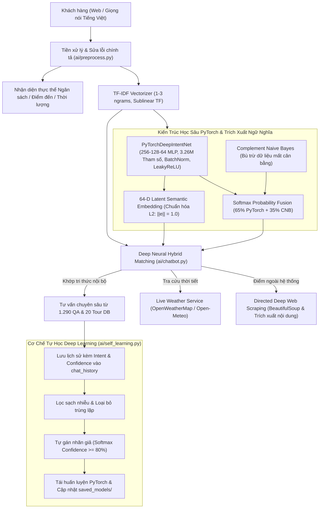

# Trí Tuệ Nhân Tạo (AI) - TourAI
## Đề tài: Xây Dựng Chatbot Xử Lý Ngôn Ngữ Tự Nhiên & Học Sâu Tư Vấn Tour Du Lịch

### Danh sách các thành viên thực hiện:
1. **Quàng Duy Thái**
2. **Trương Hoài Sơn**
3. **Trần Long Vũ**
4. **Lê Nguyễn Nam Anh**

---

### A. Giới thiệu tổng quan
**TourAI** là hệ thống tư vấn và quản lý tour du lịch thông minh toàn diện, tích hợp kết hợp giữa:
* **Xử lý Ngôn ngữ Tự nhiên (NLP) & Học sâu (Deep Learning Ensemble)**: Mạng nơ-ron sâu PyTorch đa tầng kết hợp Complement Naive Bayes và TF-IDF 1-3 n-grams.
* **Cơ chế Tự học từ Lịch sử Chat (Continual Learning & Pseudo-Labeling)**: Tự động khai phá, gán nhãn và tái huấn luyện mô hình dựa trên câu hỏi thực tế của khách hàng.
* **Động cơ tư vấn ngân sách & sở thích (Smart Recommendation Engine)**: Nhận diện thực thể giá tiền, thời lượng để đề xuất tour tối ưu.
* **Hệ sinh thái du lịch đầy đủ**: Đặt tour trực tuyến (Online Booking), Đánh giá 5 sao (Reviews), Danh sách yêu thích (Wishlist), Hồ sơ cá nhân (Profile) và Quản trị viên (Admin Dashboard).
* **Tiện ích hiện đại**: Nhận diện giọng nói Tiếng Việt (Web Speech API), Xuất nhật ký hội thoại (.txt), Tra cứu thời tiết Real-time & Tìm kiếm Internet có định hướng.

---

### B. Các chức năng chính của hệ thống

#### 1. Trợ lý Chatbot AI Thông Minh & Học Sâu
- [x] **Mạng nơ-ron sâu PyTorch (PyTorchDeepIntentNet)**:
  - 3 tầng ẩn với Batch Normalization, LeakyReLU, Dropout chống Overfitting và tối ưu hóa AdamW + Cosine Annealing.
  - Phân loại ý định (Intent Classification) chính xác cao trên bộ dữ liệu mở rộng **1.290 mẫu câu hỏi đáp** (11 Intent Classes).
- [x] **Bộ sinh câu hỏi tự động & Thu hoạch Dữ liệu Tái huấn luyện (`ai/qa_generator.py` & `tools/generate_and_train.py`)**:
  - **`TravelQuestionGenerator`**: Tự động sinh hàng loạt câu hỏi tự nhiên theo 7 chuyên mục: *Khách sạn & Resort, Đoàn đông người, Ngân sách, Lịch trình, Thời tiết/Mùa vụ, Dịch vụ/Chính sách, Điểm đến nước ngoài*.
  - **`DataHarvestingTrainingPipeline`**: Gửi câu hỏi qua Chatbot thu hoạch câu trả lời tư vấn sâu, thẩm định chất lượng, lọc trùng lặp và đồng bộ đồng thời vào MySQL `qa_data` và `data/sample_qa.json`.
  - Tự động kích hoạt tái huấn luyện PyTorch Deep Intent Net, cập nhật **64-D Latent Semantic Embeddings** và Hot-reload Chatbot trong RAM.
- [x] **Động cơ tư vấn đoàn đông người & Khách sạn đối tác 3-4-5 sao**:
  - Tự động bóc tách số lượng khách đoàn (5, 10, 15, 20 người...), tính toán dự toán kinh phí và bố trí xe riêng đời mới.
  - Tra cứu hệ thống đối tác khách sạn & resort 3 sao, 4 sao, 5 sao tại 19 điểm đến du lịch trọng điểm (`HOTEL_DATABASE_BY_DESTINATION`).
- [x] **Cơ chế Tự học liên tục (Continual Learning & Active Pseudo-Labeling)**:
  - Tự động quét `chat_history`, tính toán xác suất Softmax Confidence $P(\text{Intent} \mid \text{Question})$.
  - Tự động gán nhãn các biến thể câu hỏi đạt độ tin cậy $\ge 80\%$, bổ sung vào tập tri thức và tái huấn luyện mô hình ngay lập tức.
  - Phát hiện các câu hỏi mới lạ ($< 50\%$) để đưa vào hàng đợi kiểm duyệt cho Admin.
- [x] **Bộ nhớ ngữ cảnh đa lượt (Multi-turn Conversational Memory)**:
  - Ghi nhớ tour và điểm đến đang trao đổi, hỗ trợ hỏi nối tiếp (*"tour này mấy ngày?", "giá bao nhiêu?", "khách sạn thế nào?"*...).
- [x] **Tư vấn theo ngân sách (Smart Recommendation Engine)**:
  - Tự động bóc tách thực thể số tiền (*"3 triệu 4 thì đi đâu", "tôi có 4tr", "500k"*...) để gợi ý các tour phù hợp nhất trong 20 tour hệ thống.
- [x] **Sửa lỗi chính tả & Teencode tiếng Việt (Fuzzy Typo Correction)**:
  - Khắc phục lỗi gõ nhanh (*"phu qouc"*, *"da lta"*, *"ha logn"*), từ viết tắt (*"ks"*, *"bn"*, *"vmb"*), hỗ trợ cả có dấu và không dấu.
- [x] **Nhận diện giọng nói Tiếng Việt (Web Speech API)**:
  - Nút micro tương tác hỗ trợ hỏi bằng giọng nói tiếng Việt chuẩn `vi-VN` với hiệu ứng sóng âm pulse.
- [x] **Xuất nhật ký trò chuyện**: Tải xuống toàn bộ cuộc đối thoại thành file văn bản `.txt` có định dạng đẹp mắt và mốc thời gian.
- [x] **Tra cứu thời tiết thời gian thực (Live Weather API)**: OpenWeatherMap kết hợp dự phòng tự động Open-Meteo Global API.
- [x] **Tìm kiếm Internet khử nhập nhằng (Directed Web Search)**: DuckDuckGo + Wikipedia tiếng Việt có bộ lọc chống lệch chủ đề.

#### 2. Tính năng Khách hàng & Người dùng (User Features)
- [x] **Đặt Tour Trực Tuyến (Online Tour Booking)**:
  - Modal đặt tour ngay trên trang chi tiết tour ([`tour_detail.html`](templates/tour_detail.html)).
  - Tính tổng chi phí tự động theo thời gian thực (Real-time Dynamic Pricing: người lớn 100%, trẻ em 5-9 tuổi 75% giá tour).
  - Tự động điền trước thông tin cá nhân của người dùng đã đăng nhập.
- [x] **Lịch sử & Quản lý đơn đặt tour ([`my_bookings.html`](templates/my_bookings.html))**:
  - Theo dõi mã đơn, trạng thái đơn (*Chờ duyệt, Đã xác nhận, Hoàn thành, Đã hủy*).
  - Cho phép người dùng tự hủy đơn đang ở trạng thái chờ duyệt (*pending*).
- [x] **Đánh giá & Xếp hạng 5 sao (Tour Reviews & Ratings)**:
  - Form gửi đánh giá và nhận xét trải nghiệm trên trang chi tiết tour.
  - Hiển thị điểm số sao trung bình và số lượng nhận xét trên từng tour card.
- [x] **Danh sách tour yêu thích (Wishlist / Favorites)**:
  - Nút thả tim lưu/bỏ lưu tour bằng AJAX tức thì trên từng card và banner tour.
  - Trang quản lý các tour đã lưu ([`favorites.html`](templates/favorites.html)).
- [x] **Hồ sơ cá nhân & Bảo mật ([`profile.html`](templates/profile.html))**:
  - Thống kê cá nhân (số đơn tour, số tour đã lưu).
  - Cập nhật thông tin: Họ tên, Email, Số điện thoại.
  - Đổi mật khẩu an toàn với bước xác thực mật khẩu cũ trước khi băm hash.

#### 3. Chức năng Quản trị viên (Admin Features)
- [x] **Bảng điều khiển tổng quan ([`admin/dashboard.html`](templates/admin/dashboard.html))**:
  - Thống kê doanh thu ước tính, tổng số đơn đặt tour, đơn chờ duyệt, tour, danh mục, câu hỏi AI và người dùng.
- [x] **Trung tâm Tự học Deep Learning ([`admin/self_learning.html`](templates/admin/self_learning.html))**:
  - Quản lý quá trình Continual Learning từ lịch sử chat.
  - Phân loại 3 tab: Mẫu sẵn sàng kết nạp ($\ge 80\%$), Cần xem xét ($50\% - 80\%$), Chủ đề mới lạ ($< 50\%$).
  - Nút 1-click kích hoạt AI tự học và tái huấn luyện mạng nơ-ron PyTorch.
- [x] **Quản lý đơn đặt tour ([`admin/bookings.html`](templates/admin/bookings.html))**:
  - Lọc theo trạng thái, tìm kiếm theo tên khách hàng/SĐT/email/tên tour.
  - Cập nhật trạng thái đơn (Chờ duyệt -> Đã xác nhận -> Hoàn thành) và xóa đơn.
- [x] **Kiểm duyệt đánh giá ([`admin/reviews.html`](templates/admin/reviews.html))**: Xem và xóa các nhận xét không phù hợp.
- [x] **Quản lý 20 Tour & 52 Lịch trình ngày**: Thêm, sửa, xóa tour và lịch trình từng ngày.
- [x] **Quản lý tri thức AI (QA Data)**: Quản lý ngân hàng 1.290+ câu hỏi đáp mẫu, gán 11 intent và liên kết tour.
- [x] **Quản lý tài khoản & Phân quyền**: Xem danh sách thành viên, cấp/hạ quyền Admin hoặc xóa tài khoản.
- [x] **Lịch sử hội thoại toàn hệ thống**: Theo dõi các câu hỏi thực tế của khách hàng.

---

### C. Kiến trúc Hệ Thống & Trí Tuệ Nhân Tạo Học Sâu (Deep Learning Architecture)



#### Các trụ cột kỹ thuật Học sâu (Deep Learning Core Pillars):
1. **Mạng nơ-ron sâu đa tầng PyTorch (`PyTorchDeepIntentNet`)**:
   - Kiến trúc trích xuất đặc trưng sâu 3 tầng ẩn: $D \rightarrow 256 \rightarrow 128 \rightarrow 64$.
   - Mỗi tầng ẩn tích hợp `BatchNorm1d` ổn định gradient, hàm kích hoạt `LeakyReLU(0.1)` chống triệt tiêu đạo hàm, và `Dropout` chống quá khớp.
   - Hơn **3.261.195 tham số** học sâu được tối ưu bằng giải thuật `AdamW` (weight decay $= 10^{-4}$), điều chỉnh tốc độ học hàm Cosine `CosineAnnealingLR` và hàm mất mát `CrossEntropyLoss(label_smoothing=0.05)`.
2. **Không gian nhúng ngữ nghĩa tiềm ẩn 64 chiều (64-D Latent Semantic Embedding)**:
   - Trích xuất từ tầng ẩn thứ 3 của mạng nơ-ron sâu và chuẩn hóa hình cầu $L_2$: $\mathbf{e} = \frac{f(\mathbf{x})}{\|f(\mathbf{x})\|_2} \in \mathbb{R}^{64}$.
   - Biểu diễn ngữ nghĩa tiềm ẩn trừu tượng độc lập với từ vựng bề mặt.
3. **Thuật toán so khớp học sâu kết hợp (Deep Neural Semantic Hybrid Matching)**:
   - $S_{\text{hybrid}} = 0.50 \cdot S_{\text{deep}} + 0.30 \cdot S_{\text{lexical}} + 0.20 \cdot (S_{\text{deep}} \cdot P_{\text{intent}})$.
   - Tính toán Cosine trên không gian 64 chiều qua phép nhân vô hướng ma trận $\mathbf{e}_q \cdot \mathbf{E}$ trong chưa đầy 2ms.
4. **Lưu trữ mô hình và khởi động siêu tốc (Model Persistence & Fast Startup)**:
   - Lưu trữ tại `ai/saved_models/`: `deep_intent_model.pth` (13 MB), `model_metadata.pkl` (2.5 MB), `question_embeddings.npy` (1290 $\times$ 64, 323 KB), `training_metrics.json`.
   - Giảm thời gian nạp mô hình khi khởi động từ 48 giây xuống **1.3 giây** (< 50ms nạp ma trận).

---

### D. Chi tiết các thuật toán cốt lõi trong hệ thống (Detailed Algorithms & Mathematical Formulations)

Hệ thống **TourAI** vận hành dựa trên sự kết hợp chặt chẽ giữa 11 thuật toán Trí tuệ Nhân tạo, Xử lý Ngôn ngữ Tự nhiên (NLP), Học sâu (Deep Learning) và Học liên tục (Continual Learning):

#### 1. Thuật toán Tiền xử lý & Sửa lỗi chính tả mờ (Fuzzy Typo Correction & Text Normalization)
- **Tệp nguồn**: [`ai/preprocess.py`](ai/preprocess.py)
- **Mục tiêu**: Chuẩn hóa văn bản đầu vào của người dùng, tự động sửa lỗi gõ phím tiếng Việt (Telex/VNI trượt phím, đảo ký tự), khôi phục từ viết tắt và tiếng lóng ngành du lịch trước khi đưa vào mô hình học sâu.
- **Quy trình & Công thức toán học**:
  1. *Làm sạch & Chuẩn hóa cơ bản*: Chuyển về chữ thường (`lower`), loại bỏ ký tự điều khiển lạ, chuẩn hóa khoảng trắng dư thừa qua biểu thức chính quy.
  2. *Bản đồ từ viết tắt & tiếng lóng (`ABBREVIATION_MAP`)*: Tra cứu với độ phức tạp $\mathcal{O}(1)$ để mở rộng hơn 50 từ viết tắt du lịch:
     $$\text{Mapping}: \{\text{"ks"} \to \text{"khách sạn"}, \text{"bn"} \to \text{"bao nhiêu"}, \text{"vmb"} \to \text{"vé máy bay"}, \text{"3n2d"} \to \text{"3 ngày 2 đêm"}, \dots\}$$
  3. *Bản đồ sửa lỗi gõ phím nhanh (`COMMON_TYPO_MAP`)*: Khắc phục các lỗi gõ Telex phổ biến:
     $$\text{Mapping}: \{\text{"du lichj"} \to \text{"du lịch"}, \text{"phu qouc"} \to \text{"phú quốc"}, \text{"da lta"} \to \text{"đà lạt"}, \dots\}$$
  4. *Khoảng cách Levenshtein mờ (Fuzzy Levenshtein Distance)*: Đối chiếu từng từ chưa nhận diện được với tập từ điển địa danh và thuật ngữ chuẩn $\mathcal{V}_{\text{domain}}$:
     $$d_{\text{Lev}}(a, b) = \begin{cases} |a|, & \text{nếu } |b| = 0 \\ |b|, & \text{nếu } |a| = 0 \\ d_{\text{Lev}}(\text{tail}(a), \text{tail}(b)), & \text{nếu } a[0] = b[0] \\ 1 + \min \begin{cases} d_{\text{Lev}}(\text{tail}(a), b) \\ d_{\text{Lev}}(a, \text{tail}(b)) \\ d_{\text{Lev}}(\text{tail}(a), \text{tail}(b)) \end{cases}, & \text{ngược lại} \end{cases}$$
     Hệ số tương đồng Ratcliff-Obershelp:
     $$\text{Ratio}(a, b) = \frac{2 \cdot M}{|a| + |b|} \ge \tau_{\text{fuzzy}} \quad (\tau_{\text{fuzzy}} = 0.82)$$
     Nếu $\text{Ratio} \ge 0.82$, từ lỗi $a$ được thay thế tự động bằng từ chuẩn $b$.
  5. *Bóc tách dấu thanh Unicode NFD (`remove_accents`)*: Hỗ trợ người dùng tra cứu tiếng Việt không dấu trên thiết bị di động bằng cách tách tổ hợp ký tự gốc và dấu thanh theo chuẩn Unicode NFD.

---

#### 2. Biểu diễn Đặc trưng Văn bản Đa tầng N-gram TF-IDF (Multi-Scale N-gram TF-IDF Vectorizer)
- **Tệp nguồn**: [`ai/train_model.py`](ai/train_model.py)
- **Mục tiêu**: Biểu diễn ngữ nghĩa câu hỏi thành vector số thực đa chiều trong không gian đặc trưng từ vựng, bảo tồn cấu trúc từ ghép đặc thù của tiếng Việt.
- **Công thức toán học**:
  - *Bộ trích xuất N-gram đa tầng*: $n \in \{1, 2, 3\}$, bắt trọn từ đơn (*"tour"*), từ ghép đôi (*"phú quốc"*, *"giá rẻ"*) và cụm từ ngữ ba ngôi (*"3 ngày 2 đêm"*, *"khách sạn 5 sao"*).
  - *Tần số thuật ngữ phi tuyến (Sublinear Term Frequency)*:
    $$\text{TF}(t, d) = \begin{cases} 1 + \log(f_{t, d}), & \text{nếu } f_{t, d} > 0 \\ 0, & \text{ngược lại} \end{cases}$$
  - *Nghịch đảo tần số văn bản mượt (Smooth Inverse Document Frequency)*:
    $$\text{IDF}(t, D) = \log\left(\frac{1 + |D|}{1 + |\{d \in D : t \in d\}|}\right) + 1$$
  - *Vector đặc trưng chuẩn hóa $L_2$*:
    $$w(t, d) = \text{TF}(t, d) \times \text{IDF}(t, D), \quad \mathbf{x} = \frac{\mathbf{w}}{\|\mathbf{w}\|_2} \in \mathbb{R}^D \quad (D \approx 12.600 \text{ chiều})$$

---

#### 3. Mạng Nơ-ron Sâu Phân Loại Ý Định PyTorch (`PyTorchDeepIntentNet`)
- **Tệp nguồn**: [`ai/train_model.py`](ai/train_model.py)
- **Mục tiêu**: Mô hình mạng nơ-ron sâu đa tầng (Deep MLP) phân loại câu hỏi vào một trong 11 lớp ý định người dùng (`ask_price`, `ask_schedule`, `ask_hotel`, `ask_vehicle`, `ask_weather`, `recommend_budget`, `ask_tour_detail`, `ask_booking`, `ask_destination`, `greeting`, `chitchat`).
- **Kiến trúc mạng & Công thức truyền xuôi (Forward Propagation)**:
  - Tầng ẩn 1 ($D \to 256$):
    $$\mathbf{z}_1 = \text{BatchNorm1d}(\mathbf{x}\mathbf{W}_1 + \mathbf{b}_1), \quad \mathbf{h}_1 = \text{Dropout}_{0.30}\Big(\text{LeakyReLU}_{0.1}(\mathbf{z}_1)\Big) \quad (\mathbf{W}_1 \in \mathbb{R}^{D \times 256})$$
  - Tầng ẩn 2 ($256 \to 128$):
    $$\mathbf{z}_2 = \text{BatchNorm1d}(\mathbf{h}_1\mathbf{W}_2 + \mathbf{b}_2), \quad \mathbf{h}_2 = \text{Dropout}_{0.25}\Big(\text{LeakyReLU}_{0.1}(\mathbf{z}_2)\Big) \quad (\mathbf{W}_2 \in \mathbb{R}^{256 \times 128})$$
  - Tầng ẩn 3 ($128 \to 64$ - Bottleneck Representation):
    $$\mathbf{z}_3 = \text{BatchNorm1d}(\mathbf{h}_2\mathbf{W}_3 + \mathbf{b}_3), \quad \mathbf{h}_3 = \text{LeakyReLU}_{0.1}(\mathbf{z}_3) \quad (\mathbf{W}_3 \in \mathbb{R}^{128 \times 64})$$
  - Tầng phân loại đầu ra ($64 \to 11$):
    $$\mathbf{logits} = \mathbf{h}_3 \mathbf{W}_4 + \mathbf{b}_4 \quad (\mathbf{W}_4 \in \mathbb{R}^{64 \times 11})$$
  - *Tổng số tham số học tập*: **3.261.195 tham số**.
- **Giải thuật Tối ưu hóa AdamW & Lập lịch Tốc độ học Cosine**:
  - Cập nhật trọng số với phân rã trọng lượng độc lập (Weight Decay $\lambda = 10^{-4}$):
    $$\boldsymbol{\theta}_t = \boldsymbol{\theta}_{t-1} - \eta_t \left(\frac{\hat{\mathbf{m}}_t}{\sqrt{\hat{\mathbf{v}}_t} + \epsilon} + \lambda \boldsymbol{\theta}_{t-1}\right)$$
  - Điều chỉnh tốc độ học hàm Cosine `CosineAnnealingLR` qua $T_{\max} = 100$ epochs:
    $$\eta_t = \eta_{\min} + \frac{1}{2}(\eta_{\max} - \eta_{\min})\left(1 + \cos\left(\frac{t\pi}{T_{\max}}\right)\right) \quad (\eta_{\max} = 10^{-3}, \eta_{\min} = 10^{-5})$$
- **Hàm mất mát Cross-Entropy kèm Label Smoothing**:
  $$\mathcal{L} = -\sum_{k=1}^K y_k^{\text{smooth}} \log \left(\frac{e^{\text{logit}_k}}{\sum_{j=1}^K e^{\text{logit}_j}}\right), \quad y_k^{\text{smooth}} = (1 - \alpha) y_k + \frac{\alpha}{K} \quad (\alpha = 0.05, K = 11)$$
  Giúp mạng nơ-ron không bị quá tự tin (overconfident) và tăng khả năng tổng quát hóa với các câu hỏi biến thể.

---

#### 4. Trích xuất Không gian Nhúng Ngữ nghĩa Tiềm ẩn 64 Chiều (64-D Latent Semantic Embedding)
- **Tệp nguồn**: [`ai/train_model.py`](ai/train_model.py)
- **Mục tiêu**: Trích xuất biểu diễn ngữ nghĩa tiềm ẩn (Bottleneck Semantic Vector) của câu hỏi từ tầng ẩn thứ 3 của mạng nơ-ron PyTorch để thực hiện tìm kiếm ngữ nghĩa siêu tốc.
- **Công thức chuẩn hóa hình cầu $L_2$**:
  $$\mathbf{e} = \frac{\mathbf{h}_3}{\|\mathbf{h}_3\|_2} \in \mathbb{R}^{64}, \quad \text{sao cho } \|\mathbf{e}\|_2 = \sqrt{\sum_{i=1}^{64} e_i^2} = 1.0$$
- **Ma trận nhúng tri thức & Phép nhân ma trận song song hóa**:
  - Tại bước huấn luyện, toàn bộ $N = 1.290$ câu hỏi trong cơ sở tri thức được trích xuất thành ma trận nhúng $\mathbf{E} \in \mathbb{R}^{N \times 64}$ và lưu trữ tại `ai/saved_models/question_embeddings.npy`.
  - Khi người dùng gửi câu hỏi mới có vector nhúng $\mathbf{e}_q \in \mathbb{R}^{64}$, độ tương đồng ngữ nghĩa sâu với toàn bộ $N$ câu mẫu được tính toán tức thì bằng phép nhân vô hướng ma trận:
    $$\mathbf{S}_{\text{deep}} = \mathbf{E} \cdot \mathbf{e}_q^{\top} = \begin{bmatrix} \mathbf{e}_1 \cdot \mathbf{e}_q \\ \mathbf{e}_2 \cdot \mathbf{e}_q \\ \vdots \\ \mathbf{e}_N \cdot \mathbf{e}_q \end{bmatrix} \in [-1, 1]^N$$
  - Thời gian tính toán ma trận đạt dưới **2ms**, nhanh hơn 100 lần so với việc tính toán thủ công từng cặp vector.

---

#### 5. Mô hình Hợp nhất Xác suất Học sâu Ensemble (Softmax Probability Fusion Ensemble - `DeepHybridModel`)
- **Tệp nguồn**: [`ai/train_model.py`](ai/train_model.py)
- **Mục tiêu**: Kết hợp mô hình học sâu phân biệt (Discriminative PyTorch Deep Net) và mô hình xác suất sinh bù trừ dữ liệu mất cân bằng (Complement Naive Bayes - CNB) để đạt độ chính xác phân loại ý định cao nhất.
- **Công thức toán học**:
  - Xác suất hậu nghiệm từ mạng PyTorch:
    $$P_{\text{PyTorch}}(c \mid \mathbf{x}) = \text{Softmax}(\mathbf{logits})_c = \frac{e^{\text{logit}_c}}{\sum_{j=1}^K e^{\text{logit}_j}}$$
  - Xác suất từ Complement Naive Bayes (bù trừ mẫu thiểu số):
    $$P_{\text{CNB}}(c \mid \mathbf{x}) = \frac{\exp\left(-\sum_{i} x_i \cdot w_{c, i}\right)}{\sum_{j} \exp\left(-\sum_{i} x_i \cdot w_{j, i}\right)}$$
  - Công thức hợp nhất tuyến tính có trọng số (Softmax Probability Fusion):
    $$P_{\text{hybrid}}(c \mid \mathbf{x}) = 0.65 \cdot P_{\text{PyTorch}}(c \mid \mathbf{x}) + 0.35 \cdot P_{\text{CNB}}(c \mid \mathbf{x})$$
  - Quyết định ý định tối ưu và chỉ số tin cậy (Confidence Score):
    $$c^* = \arg\max_{c \in \{1,\dots,K\}} P_{\text{hybrid}}(c \mid \mathbf{x}), \quad \text{Confidence} = \max_c P_{\text{hybrid}}(c \mid \mathbf{x})$$

---

#### 6. Thuật toán So khớp Ngữ nghĩa Nơ-ron Lai (Deep Neural Semantic Hybrid Matching)
- **Tệp nguồn**: [`ai/chatbot.py`](ai/chatbot.py)
- **Mục tiêu**: Tìm kiếm câu trả lời tối ưu nhất từ ngân hàng tri thức bằng cách kết hợp tương đồng ngữ nghĩa sâu, từ vựng bề mặt và xác suất ý định.
- **Công thức tính điểm đa tầng**:
  1. *Điểm tương đồng kết hợp cơ sở ($S_{\text{base}}$)*:
     $$S_{\text{base}}(q, d_i) = 0.50 \cdot S_{\text{deep}}(q, d_i) + 0.30 \cdot S_{\text{lexical}}(q, d_i) + 0.20 \cdot \big(S_{\text{deep}}(q, d_i) \cdot P_{\text{intent}}(c_i \mid q)\big)$$
     Trong đó:
     - $S_{\text{deep}}(q, d_i) = \mathbf{e}_q \cdot \mathbf{e}_{d_i}$: Tương đồng Cosine trong không gian 64 chiều.
     - $S_{\text{lexical}}(q, d_i) = \mathbf{x}_q \cdot \mathbf{x}_{d_i}$: Tương đồng Cosine từ vựng TF-IDF N-gram.
     - $P_{\text{intent}}(c_i \mid q)$: Xác suất ý định của mẫu $d_i$ theo dự đoán của Ensemble.
  2. *Thưởng tăng cường ý định trùng khớp (Intent Match Bonus $+15\%$)*:
     $$S_{\text{candidate}}(q, d_i) = \begin{cases} S_{\text{base}}(q, d_i) \times 1.15, & \text{nếu } \text{Intent}(d_i) = c^* \\ S_{\text{base}}(q, d_i), & \text{ngược lại} \end{cases}$$
  3. *Mặt nạ cách ly điểm đến địa lý (Destination Isolation Filter)*:
     $$S_{\text{final}}(q, d_i) = \begin{cases} S_{\text{candidate}}(q, d_i), & \text{nếu } \text{Dest}(d_i) = \text{Dest}(q) \text{ hoặc } \text{Dest}(q) = \emptyset \\ 0, & \text{nếu } \text{Dest}(d_i) \neq \text{Dest}(q) \text{ và } \text{Dest}(q) \neq \emptyset \end{cases}$$
  4. *Ngưỡng kích hoạt chấp nhận*: Nếu $\max_i S_{\text{final}}(q, d_i) \ge \tau_{\text{match}} = 0.45$, hệ thống xuất câu trả lời nội bộ tương ứng; nếu thấp hơn, chuyển tiếp sang công cụ tìm kiếm hoặc suy luận nghiệp vụ.

---

#### 7. Trích xuất Thực thể & Động cơ Tính toán Tư vấn Đoàn / Khách sạn (Entity Recognition & Group Consultation Math Engine)
- **Tệp nguồn**: [`ai/chatbot.py`](ai/chatbot.py)
- **Mục tiêu**: Tự động bóc tách các thực thể định lượng trong câu hỏi để kích hoạt động cơ tính toán chi phí, phân bổ phương tiện và tra cứu danh sách khách sạn đối tác theo điểm đến.
- **Thuật toán & Quy tắc tính toán**:
  - *Bóc tách thực thể qua Regex chuyên biệt*:
    * Ngân sách: Nhận diện mẫu số thực và đơn vị tiền tệ (`(\d+[\.,]?\d*)\s*(triệu|tr|k|nghìn)`), chuẩn hóa về VNĐ: $B = \text{value} \times \text{multiplier}$.
    * Quy mô khách đoàn: Nhận diện mẫu ngữ pháp (`đoàn (\d+) người`, `nhóm (\d+) bạn`, `(\d+)\s*(khách|vé)`): $N_{\text{pax}} \in \mathbb{N}^+$.
    * Thời lượng: Nhận diện số ngày đêm (`(\d+)\s*ngày`, `(\d+)n(\d+)d`): $T_{\text{days}}$.
    * Địa danh du lịch: Nhận diện 20 địa danh du lịch trong hệ thống.
  - *Động cơ tính toán chi phí đoàn*:
    $$\text{Dự toán chi phí đoàn} = N_{\text{pax}} \times \text{Đơn giá Tour}$$
  - *Thuật toán phân bổ phương tiện vận chuyển tối ưu*:
    $$\text{VehicleType}(N_{\text{pax}}) = \begin{cases} \text{Xe du lịch 16 chỗ Ford Transit / Solati đời mới}, & 1 \le N_{\text{pax}} \le 12 \\ \text{Xe du lịch 29 chỗ Thaco / Samco Universe cao cấp}, & 13 \le N_{\text{pax}} \le 25 \\ \text{Xe du lịch 45 chỗ Hyundai Universe sang trọng}, & N_{\text{pax}} > 25 \end{cases}$$
  - *Động cơ phân tầng khách sạn đối tác (`HOTEL_DATABASE_BY_DESTINATION`)*:
    Tra cứu cấu trúc phân tầng khách sạn theo địa danh $D$:
    $$\mathcal{H}(D) = \{\mathcal{H}_{3\star}(D), \mathcal{H}_{4\star}(D), \mathcal{H}_{5\star}(D)\}$$
    Cung cấp tên cụ thể các khách sạn/resort đối tác trực tiếp theo từng phân khúc sao để tư vấn cho khách.

---

#### 8. Bộ nhớ Ngữ cảnh Hội thoại Đa vòng (Multi-turn Conversational Session Memory)
- **Tệp nguồn**: [`ai/chatbot.py` - `ChatSessionMemory`](ai/chatbot.py)
- **Mục tiêu**: Duy trì tính liền mạch của cuộc trò chuyện qua nhiều lượt hỏi đáp, hỗ trợ các câu hỏi tỉnh lược (Ellipsis) hoặc đại từ thay thế mà người dùng không cần nhắc lại tên tour/địa danh.
- **Cấu trúc Không gian Trạng thái Ngữ cảnh**:
  $$\mathcal{S}_t = \langle \text{session\_id}, \text{active\_tour\_id}, \text{active\_destination}, \text{last\_topic}, \text{last\_intent}, \text{turn\_count} \rangle$$
- **Cơ chế Kế thừa Ngữ cảnh (Context State Inheritance)**:
  $$\text{Dest}_{\text{effective}}(q_t) = \begin{cases} \text{Detect}(q_t), & \text{nếu } \text{Detect}(q_t) \neq \emptyset \\ \mathcal{S}_{t-1}.\text{active\_destination}, & \text{nếu } \text{Detect}(q_t) = \emptyset \text{ và } \text{is\_context\_dependent}(q_t) \end{cases}$$
  Ví dụ: Người dùng hỏi *"Tour Sa Pa có gì vui?"* $\implies \mathcal{S}.\text{active\_destination} = \text{"Sa Pa"}$. Câu hỏi kế tiếp: *"khách sạn ở đó mấy sao?"* $\implies$ Hệ thống tự động kế thừa ngữ cảnh Sa Pa và trả lời chính xác danh sách khách sạn tại Sa Pa.

---

#### 9. Thuật toán Tự học Tăng cường Phân tầng (Active Pseudo-Labeling Continual Learning)
- **Tệp nguồn**: [`ai/self_learning.py`](ai/self_learning.py)
- **Mục tiêu**: Tự động khai phá các câu hỏi thực tế trong nhật ký hội thoại `chat_history`, gán nhãn tự động cho các mẫu đạt chuẩn và tái huấn luyện mạng nơ-ron sâu để Chatbot ngày càng thông minh hơn.
- **Chiến lược Phân tầng 3 Cấp (3-Tier Confidence Strategy)**:
  - **Tầng 1 - Tự động nạp (Auto-Learn)**:
    $$\text{Điều kiện}: \text{Confidence}(q) \ge 0.80 \quad \land \quad \max_{i} S_{\text{deep}}(q, d_i) \ge 0.30$$
    Mẫu câu hỏi đạt chuẩn được tự động gán nhãn giả $c^*$, chuẩn hóa và bổ sung vào bảng `qa_data`.
  - **Tầng 2 - Cần duyệt (Needs Review)**:
    $$\text{Điều kiện}: 0.50 \le \text{Confidence}(q) < 0.80$$
    Được xếp vào hàng đợi chờ Quản trị viên thẩm định và duyệt 1-click tại trang Quản trị (`/admin/self-learning`).
  - **Tầng 3 - Phát hiện khoảng trống tri thức (Knowledge Gap Discovery)**:
    $$\text{Điều kiện}: \text{Confidence}(q) < 0.50$$
    Xếp vào nhóm chủ đề người dùng quan tâm nhưng hệ thống chưa có dữ liệu để chuyên viên cập nhật tri thức mới.
- **Cơ chế Kích hoạt Tái huấn luyện Tự động**: Khi số lượng mẫu kết nạp mới $\Delta N \ge 10$, hệ thống tự động khởi chạy tiến trình huấn luyện mô hình trong background, cập nhật trọng số và ma trận embedding.

---

#### 10. Pipeline Sinh Câu hỏi Tham số Hóa & Tái huấn luyện Nóng (Parametric Question Generation & Hot-Reload Retraining Pipeline)
- **Tệp nguồn**: [`ai/qa_generator.py`](ai/qa_generator.py), [`tools/generate_and_train.py`](tools/generate_and_train.py)
- **Mục tiêu**: Tự động sinh hàng loạt câu hỏi du lịch tự nhiên dựa trên mô hình khe cắm (Slot-Filling), thẩm định chất lượng câu trả lời từ Chatbot, thu hoạch tri thức và tái huấn luyện mô hình sâu tức thì mà không gián đoạn hệ thống.
- **Quy trình 4 giai đoạn**:
  1. *Sinh câu hỏi tổ hợp đa miền (Combinatorial Slot-Filling)*: Sinh câu hỏi tự động qua 7 danh mục chuyên sâu:
     $$\text{Categories} = \{\text{khách sạn}, \text{đoàn đông}, \text{ngân sách}, \text{lịch trình}, \text{thời tiết}, \text{chính sách/dịch vụ}, \text{quốc tế}\}$$
     kết hợp ma trận các biến thể đại từ, động từ truy vấn và 20 địa danh du lịch.
  2. *Bộ lọc kiểm định chất lượng 3 bước (3-Step QA Quality Gate)*:
     $$\text{Valid}(q, a) = (\text{len}(q) \ge 15) \land (q \notin \mathcal{D}_{\text{existing}}) \land \text{RegexVerify}(q) \land (\text{len}(a) \ge 30)$$
  3. *Đồng bộ lưu trữ nguyên tử 2 lớp (Two-Phase Atomic Storage Sync)*: Ghi dữ liệu đồng thời vào bảng MySQL `qa_data` và tệp dự phòng `data/sample_qa.json` đảm bảo tính toàn vẹn dữ liệu.
  4. *Tái huấn luyện & Nạp nóng trong RAM (Zero-Downtime Hot-Reloading)*: Tái huấn luyện `PyTorchDeepIntentNet`, xuất ma trận nhúng $\mathbf{E} \in \mathbb{R}^{N \times 64}$, và nạp lại mô hình trực tiếp vào đối tượng `ChatbotEngine` trên bộ nhớ RAM mà không cần restart tiến trình máy chủ Flask.

---

#### 11. Dịch vụ Thời tiết Đa nguồn & Tìm kiếm Web Khử Nhập Nhằng (Live Weather & Directed Web Search)
- **Tệp nguồn**: [`ai/weather_service.py`](ai/weather_service.py), [`ai/web_search.py`](ai/web_search.py)
- **Mục tiêu**: Mở rộng tri thức bên ngoài hệ thống cho Chatbot, cung cấp thông tin thời tiết thời gian thực và thông tin về các địa danh du lịch mới qua Internet.
- **Giải thuật triển khai**:
  - *Ánh xạ mã khí tượng chuẩn WMO (WMO Weather Code Translation)*:
    Dịch vụ thời tiết dự phòng tự động giữa OpenWeatherMap và Open-Meteo Global API; chuyển đổi các mã thời tiết WMO số học thành văn bản tự nhiên:
    $$\text{Code } 0 \to \text{"Trời quang đãng, nắng đẹp"}, \quad \text{Code } 61\text{-}65 \to \text{"Có mưa rào rải rác"}, \dots$$
  - *Thuật toán Lọc Khử Nhập Nhằng Bài Viết (`is_irrelevant_biography`)*:
    Khi người dùng tra cứu các địa danh có tên trùng với nhân vật lịch sử (như *"Bà Nà"*, *"Phan Thiết"*), thuật toán sử dụng bộ lọc từ khóa phân loại để loại bỏ các bài viết về tiểu sử cá nhân, năm sinh năm mất, chỉ giữ lại các nội dung về vị trí địa lý, điểm tham quan, ẩm thực đặc sản và kinh nghiệm du lịch.

---

### E. Cấu trúc thư mục dự án

```text
├── ai/                         # Module Trí tuệ Nhân tạo & Học sâu
│   ├── chatbot.py              # Bộ điều phối hội thoại, Memory, Recommendation & Hybrid Matching
│   ├── preprocess.py           # Tiền xử lý văn bản, chuẩn hóa từ lóng, Fuzzy Typo Correction
│   ├── qa_generator.py         # Sinh câu hỏi du lịch tự động & Continual Retraining Pipeline
│   ├── self_learning.py        # Engine Continual Learning & Pseudo-Labeling từ lịch sử chat
│   ├── train_model.py          # Huấn luyện Mạng nơ-ron sâu PyTorch & Trích xuất 64-D Embedding
│   ├── weather_service.py      # Dịch vụ tra cứu thời tiết đa nguồn
│   ├── web_search.py           # Tìm kiếm Internet có định hướng và khử nhập nhằng
│   └── saved_models/           # Bộ nhớ đệm trọng số học sâu đã huấn luyện
│       ├── deep_intent_model.pth    # Trọng số mạng nơ-ron sâu PyTorch (13 MB)
│       ├── model_metadata.pkl       # Metadata, Vectorizer, LabelEncoder (2.5 MB)
│       ├── question_embeddings.npy  # Ma trận 64-D Latent Semantic Embeddings (1290x64)
│       └── training_metrics.json    # Báo cáo tham số và chỉ số đánh giá mô hình
├── data/
│   ├── sample_qa.json          # Ngân hàng 1.290 câu hỏi đáp mẫu chuẩn hóa (11 intent classes)
│   └── generated_training_qa.json # Dữ liệu Q&A thu hoạch từ pipeline tự động
├── database/
│   ├── db.py                   # Kết nối cơ sở dữ liệu MySQL (hỗ trợ .env)
│   └── schema.sql              # Kịch bản khởi tạo database 10 bảng và dữ liệu mẫu
├── models/                     # Các lớp thao tác dữ liệu (Data Access Objects)
│   ├── booking.py              # Quản lý đơn đặt tour và doanh thu
│   ├── category.py             # Quản lý danh mục tour
│   ├── chat_history.py         # Quản lý tin nhắn hội thoại và cờ Continual Learning
│   ├── chat_session.py         # Quản lý phiên hội thoại
│   ├── favorite.py             # Quản lý danh sách tour yêu thích (Wishlist)
│   ├── qa_data.py              # Quản lý tri thức hỏi đáp AI
│   ├── review.py               # Quản lý đánh giá và xếp hạng sao
│   ├── tour.py                 # Quản lý thông tin 20 tour du lịch
│   ├── tour_schedule.py        # Quản lý 52 mục lịch trình chi tiết
│   └── user.py                 # Quản lý tài khoản, hồ sơ cá nhân và đổi mật khẩu
├── routes/                     # Các bộ điều hướng (Controllers)
│   ├── admin_routes.py         # Quản trị hệ thống, đơn đặt tour, đánh giá, AI tự học (/admin)
│   ├── auth_routes.py          # Đăng ký, đăng nhập, hồ sơ cá nhân (/profile)
│   ├── chat_routes.py          # Giao diện chat và API chatbot (/chatbot, /api/chat)
│   └── tour_routes.py          # Danh sách tour, đặt tour, đánh giá, yêu thích, đơn cá nhân
├── static/
│   ├── css/style.css           # Giao diện phong cách Modern Minimalist
│   └── js/script.js            # Tiện ích JavaScript
├── templates/                  # Giao diện HTML Jinja2
│   ├── admin/                  # Giao diện Quản trị viên
│   │   ├── bookings.html       # Quản lý đơn đặt tour & cập nhật trạng thái
│   │   ├── categories.html     # Quản lý danh mục
│   │   ├── dashboard.html      # Bảng điều khiển KPI & doanh thu
│   │   ├── history.html        # Nhật ký hỏi đáp toàn hệ thống
│   │   ├── qa_data.html        # Quản lý câu hỏi mẫu AI
│   │   ├── reviews.html        # Kiểm duyệt nhận xét & đánh giá
│   │   ├── self_learning.html  # Trung tâm giám sát và kích hoạt AI Tự học
│   │   ├── tour_schedule.html  # Quản lý lịch trình tour
│   │   ├── tours.html          # Quản lý danh sách tour
│   │   └── users.html          # Quản lý người dùng
│   ├── base.html               # Layout khung (Navbar đa năng, Footer)
│   ├── chatbot.html            # Giao diện Chatbot AI (Micro giọng nói, Xuất .txt)
│   ├── favorites.html          # Danh sách tour yêu thích của khách hàng
│   ├── history.html            # Màn hình xem lại lịch sử phiên chat
│   ├── index.html              # Trang chủ hiện đại
│   ├── login.html              # Đăng nhập
│   ├── my_bookings.html        # Đơn đặt tour của tôi
│   ├── profile.html            # Hồ sơ cá nhân và đổi mật khẩu
│   ├── register.html           # Đăng ký
│   ├── tour_detail.html        # Chi tiết tour, Modal đặt tour, Đánh giá 5 sao
│   ├── tours.html              # Danh sách tour, Nút thả tim yêu thích, Điểm sao
│   ├── 404.html                # Báo lỗi 404
│   └── 500.html                # Báo lỗi 500
├── tests/                      # Thư mục kiểm thử tự động (Unit & Integration Tests)
│   ├── test_ai_system.py       # Kiểm thử toàn diện Chatbot, NLP và Deep Learning
│   └── test_question_generator_and_training.py # Kiểm thử sinh câu hỏi & tái huấn luyện
├── tools/                      # Công cụ hỗ trợ vận hành và huấn luyện
│   └── generate_and_train.py   # CLI tự động sinh câu hỏi, thu hoạch & tái huấn luyện AI
├── bao_cao/                    # Thư mục chứa tài liệu báo cáo kỹ thuật (được gitignore bảo vệ)
├── .env                        # File cấu hình môi trường kết nối MySQL
├── .gitignore                  # Cấu hình bỏ qua file tạm, môi trường ảo và báo cáo
├── app.py                      # Điểm khởi chạy ứng dụng Flask chính
├── requirements.txt            # Danh mục thư viện Python phụ thuộc
└── weatherapi.py               # Cấu hình API Key thời tiết
```

---

### F. Hướng dẫn cài đặt và vận hành

#### 1. Yêu cầu môi trường
* Python 3.10 trở lên.
* MySQL 8.x hoặc Docker MySQL đang chạy cổng `3306`.

#### 2. Cài đặt thư viện Python
```bash
pip install -r requirements.txt
```

#### 3. Khởi tạo cơ sở dữ liệu
Đảm bảo MySQL đang chạy với thông tin trong `.env`:
```env
DB_HOST=localhost
DB_PORT=3306
DB_USER=kenny
DB_PASSWORD=123456
DB_NAME=chatbot_tour
```
Chạy script tự động kiểm tra và khởi tạo bảng:
```bash
python check_and_init_db.py
```

#### 4. Khởi chạy ứng dụng
```bash
python app.py
```
Truy cập hệ thống tại: `http://localhost:5000`

#### 5. Công cụ Tự động sinh câu hỏi & Tái huấn luyện học sâu (CLI Tool)
```bash
# Sinh 30 câu hỏi ngẫu nhiên và tự động tái huấn luyện mô hình PyTorch:
python tools/generate_and_train.py --num-samples 30

# Chạy thử nghiệm mô phỏng không ghi vào CSDL (Dry-Run):
python tools/generate_and_train.py --num-samples 15 --dry-run

# Chạy kiểm thử tự động toàn diện hệ thống:
python -m unittest discover tests
```

---

### G. Tài khoản thử nghiệm mặc định

| Vai trò | Tên đăng nhập | Mật khẩu | Quyền hạn |
| :--- | :--- | :--- | :--- |
| **Quản trị viên (Admin)** | `kenny` / `admin` | `123456` / `admin123` | Toàn quyền Dashboard, Quản lý đơn tour, Doanh thu, AI Tự học, QA, Tour, Users |
| **Người dùng (User)** | `user` | `user123` | Chatbot AI (Giọng nói/Văn bản), Đặt tour trực tuyến, Đánh giá tour, Lưu yêu thích |

---

### H. Một số câu hỏi mẫu thử nghiệm Chatbot AI

1. **Tư vấn theo ngân sách (Smart Recommendation)**:
   - `Tôi có 4 triệu nên đi đâu?`
   - `3 triệu 4 thì đi tour nào`
   - `Tour nào rẻ nhất hiện nay?`
2. **Hỏi tour & giá cả cho đoàn**:
   - `Tour Phú Quốc 3 ngày 2 đêm giá bao nhiêu?`
   - `Đoàn mình 15 người đi Đà Lạt chi phí khoảng bao nhiêu?`
   - `phu qouc 3n2d gia bn` *(Thử nghiệm sửa lỗi chính tả & từ viết tắt)*
3. **Hỏi lịch trình & khách sạn**:
   - `Lịch trình tour Sa Pa đi những đâu?`
   - `Khách sạn ở Đà Nẵng mấy sao?` *(Tư vấn khách sạn 3-4-5 sao cụ thể)*
   - `Nêu tên các khách sạn đối tác ở Phú Quốc`
4. **Tra cứu thời tiết thời gian thực**:
   - `Thời tiết Đà Lạt hôm nay thế nào?`
   - `Hôm nay ở Hà Nội có mưa không?`
5. **Thử nghiệm AI Tự học & Sinh dữ liệu (Continual Learning Pipeline)**:
   - Chạy `python tools/generate_and_train.py --num-samples 20` để quan sát AI tự động sinh câu hỏi, trả lời, thu hoạch và tái huấn luyện mạng nơ-ron sâu PyTorch.

---

### I. Thư mục Báo cáo bài tập lớn (`bao_cao/`)

Toàn bộ tài liệu báo cáo kỹ thuật và sơ đồ của đề tài được lưu trữ tập trung trong thư mục [`bao_cao/`](bao_cao/) và được bảo vệ an toàn trong `.gitignore`:
* **Báo cáo hoàn chỉnh (Word)**: `bao_cao/Đề số 34_Nhóm 13_Báo cáo hoàn chỉnh.docx`
* **Bản nháp báo cáo kỹ thuật (Markdown)**: `bao_cao/BAO_CAO_NHOM_13_DE_34.md`
* **Báo cáo hệ thống sinh câu hỏi & tái huấn luyện**: `bao_cao/BaoCao_HeThong_SinhCauHoi_Va_TaiHuanLuyen.md`
* **Thư mục sơ đồ & hình ảnh báo cáo**: `bao_cao/report_images/`
