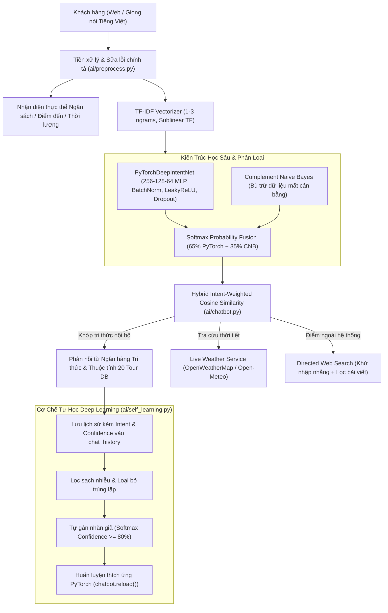

# Trí Tuệ Nhân Tạo (AI) - TourAI
## Đề tài: Xây Dựng Chatbot Xử Lý Ngôn Ngữ Tự Nhiên & Học Sâu Tư Vấn Tour Du Lịch

### Danh sách các thành viên thực hiện:
1. **Quàng Duy Thái**
2. **Trương Hoài Sơn**
3. **Trần Long Vũ**
4. **Lê Nguyễn Nam Anh**

---

### A. Giới thiệu tổng quan
**TourAI** là hệ thống tư vấn và quản lý tour du lịch thông minh toàn diện, tích hợp kết hợp giữa:
* **Xử lý Ngôn ngữ Tự nhiên (NLP) & Học sâu (Deep Learning Ensemble)**: Mạng nơ-ron sâu PyTorch đa tầng kết hợp Complement Naive Bayes và TF-IDF 1-3 n-grams.
* **Cơ chế Tự học từ Lịch sử Chat (Continual Learning & Pseudo-Labeling)**: Tự động khai phá, gán nhãn và tái huấn luyện mô hình dựa trên câu hỏi thực tế của khách hàng.
* **Động cơ tư vấn ngân sách & sở thích (Smart Recommendation Engine)**: Nhận diện thực thể giá tiền, thời lượng để đề xuất tour tối ưu.
* **Hệ sinh thái du lịch đầy đủ**: Đặt tour trực tuyến (Online Booking), Đánh giá 5 sao (Reviews), Danh sách yêu thích (Wishlist), Hồ sơ cá nhân (Profile) và Quản trị viên (Admin Dashboard).
* **Tiện ích hiện đại**: Nhận diện giọng nói Tiếng Việt (Web Speech API), Xuất nhật ký hội thoại (.txt), Tra cứu thời tiết Real-time & Tìm kiếm Internet có định hướng.

---

### B. Các chức năng chính của hệ thống

#### 1. Trợ lý Chatbot AI Thông Minh & Học Sâu
- [x] **Mạng nơ-ron sâu PyTorch (PyTorchDeepIntentNet)**:
  - 3 tầng ẩn với Batch Normalization, LeakyReLU, Dropout chống Overfitting và tối ưu hóa AdamW + Cosine Annealing.
  - Phân loại ý định (Intent Classification) chính xác cao trên bộ dữ liệu mở rộng **799 mẫu câu hỏi đáp**.
- [x] **Cơ chế Tự học liên tục (Continual Learning & Active Pseudo-Labeling)**:
  - Tự động quét `chat_history`, tính toán xác suất Softmax Confidence $P(\text{Intent} \mid \text{Question})$.
  - Tự động gán nhãn các biến thể câu hỏi đạt độ tin cậy $\ge 80\%$, bổ sung vào tập tri thức và tái huấn luyện mô hình ngay lập tức.
  - Phát hiện các câu hỏi mới lạ ($< 50\%$) để đưa vào hàng đợi kiểm duyệt cho Admin.
- [x] **Bộ nhớ ngữ cảnh đa lượt (Multi-turn Conversational Memory)**:
  - Ghi nhớ tour và điểm đến đang trao đổi, hỗ trợ hỏi nối tiếp (*"tour này mấy ngày?", "giá bao nhiêu?", "khách sạn thế nào?"*...).
- [x] **Tư vấn theo ngân sách (Smart Recommendation Engine)**:
  - Tự động bóc tách thực thể số tiền (*"3 triệu 4 thì đi đâu", "tôi có 4tr", "500k"*...) để gợi ý các tour phù hợp nhất trong 20 tour hệ thống.
- [x] **Sửa lỗi chính tả & Teencode tiếng Việt (Fuzzy Typo Correction)**:
  - Khắc phục lỗi gõ nhanh (*"phu qouc"*, *"da lta"*, *"ha logn"*), từ viết tắt (*"ks"*, *"bn"*, *"vmb"*), hỗ trợ cả có dấu và không dấu.
- [x] **Nhận diện giọng nói Tiếng Việt (Web Speech API)**:
  - Nút micro tương tác hỗ trợ hỏi bằng giọng nói tiếng Việt chuẩn `vi-VN` với hiệu ứng sóng âm pulse.
- [x] **Xuất nhật ký trò chuyện**: Tải xuống toàn bộ cuộc đối thoại thành file văn bản `.txt` có định dạng đẹp mắt và mốc thời gian.
- [x] **Tra cứu thời tiết thời gian thực (Live Weather API)**: OpenWeatherMap kết hợp dự phòng tự động Open-Meteo Global API.
- [x] **Tìm kiếm Internet khử nhập nhằng (Directed Web Search)**: DuckDuckGo + Wikipedia tiếng Việt có bộ lọc chống lệch chủ đề.

#### 2. Tính năng Khách hàng & Người dùng (User Features)
- [x] **Đặt Tour Trực Tuyến (Online Tour Booking)**:
  - Modal đặt tour ngay trên trang chi tiết tour ([`tour_detail.html`](templates/tour_detail.html)).
  - Tính tổng chi phí tự động theo thời gian thực (Real-time Dynamic Pricing: người lớn 100%, trẻ em 5-9 tuổi 75% giá tour).
  - Tự động điền trước thông tin cá nhân của người dùng đã đăng nhập.
- [x] **Lịch sử & Quản lý đơn đặt tour ([`my_bookings.html`](templates/my_bookings.html))**:
  - Theo dõi mã đơn, trạng thái đơn (*Chờ duyệt, Đã xác nhận, Hoàn thành, Đã hủy*).
  - Cho phép người dùng tự hủy đơn đang ở trạng thái chờ duyệt (*pending*).
- [x] **Đánh giá & Xếp hạng 5 sao (Tour Reviews & Ratings)**:
  - Form gửi đánh giá và nhận xét trải nghiệm trên trang chi tiết tour.
  - Hiển thị điểm số sao trung bình và số lượng nhận xét trên từng tour card.
- [x] **Danh sách tour yêu thích (Wishlist / Favorites)**:
  - Nút thả tim lưu/bỏ lưu tour bằng AJAX tức thì trên từng card và banner tour.
  - Trang quản lý các tour đã lưu ([`favorites.html`](templates/favorites.html)).
- [x] **Hồ sơ cá nhân & Bảo mật ([`profile.html`](templates/profile.html))**:
  - Thống kê cá nhân (số đơn tour, số tour đã lưu).
  - Cập nhật thông tin: Họ tên, Email, Số điện thoại.
  - Đổi mật khẩu an toàn với bước xác thực mật khẩu cũ trước khi băm hash.

#### 3. Chức năng Quản trị viên (Admin Features)
- [x] **Bảng điều khiển tổng quan ([`admin/dashboard.html`](templates/admin/dashboard.html))**:
  - Thống kê doanh thu ước tính, tổng số đơn đặt tour, đơn chờ duyệt, tour, danh mục, câu hỏi AI và người dùng.
- [x] **Trung tâm Tự học Deep Learning ([`admin/self_learning.html`](templates/admin/self_learning.html))**:
  - Quản lý quá trình Continual Learning từ lịch sử chat.
  - Phân loại 3 tab: Mẫu sẵn sàng kết nạp ($\ge 80\%$), Cần xem xét ($50\% - 80\%$), Chủ đề mới lạ ($< 50\%$).
  - Nút 1-click kích hoạt AI tự học và tái huấn luyện mạng nơ-ron PyTorch.
- [x] **Quản lý đơn đặt tour ([`admin/bookings.html`](templates/admin/bookings.html))**:
  - Lọc theo trạng thái, tìm kiếm theo tên khách hàng/SĐT/email/tên tour.
  - Cập nhật trạng thái đơn (Chờ duyệt -> Đã xác nhận -> Hoàn thành) và xóa đơn.
- [x] **Kiểm duyệt đánh giá ([`admin/reviews.html`](templates/admin/reviews.html))**: Xem và xóa các nhận xét không phù hợp.
- [x] **Quản lý 20 Tour & 52 Lịch trình ngày**: Thêm, sửa, xóa tour và lịch trình từng ngày.
- [x] **Quản lý tri thức AI (QA Data)**: Quản lý ngân hàng 799+ câu hỏi đáp, gán intent và liên kết tour.
- [x] **Quản lý tài khoản & Phân quyền**: Xem danh sách thành viên, cấp/hạ quyền Admin hoặc xóa tài khoản.
- [x] **Lịch sử hội thoại toàn hệ thống**: Theo dõi các câu hỏi thực tế của khách hàng.

---

### C. Kiến trúc Hệ Thống & Trí Tuệ Nhân Tạo



---

### D. Cấu trúc thư mục dự án

```text
├── ai/                         # Module Trí tuệ Nhân tạo & Học sâu
│   ├── chatbot.py              # Bộ điều phối hội thoại, Memory, Recommendation & Hybrid Matching
│   ├── preprocess.py           # Tiền xử lý văn bản, chuẩn hóa từ lóng, Fuzzy Typo Correction
│   ├── self_learning.py        # Engine Continual Learning & Pseudo-Labeling từ lịch sử chat
│   ├── train_model.py          # Huấn luyện Mạng nơ-ron sâu PyTorch & Complement Naive Bayes
│   ├── weather_service.py      # Dịch vụ tra cứu thời tiết đa nguồn
│   └── web_search.py           # Tìm kiếm Internet có định hướng và khử nhập nhằng
├── data/
│   └── sample_qa.json          # Ngân hàng 799 câu hỏi đáp mẫu chuẩn hóa
├── database/
│   ├── db.py                   # Kết nối cơ sở dữ liệu MySQL (hỗ trợ .env)
│   └── schema.sql              # Kịch bản khởi tạo database 10 bảng và dữ liệu mẫu
├── models/                     # Các lớp thao tác dữ liệu (Data Access Objects)
│   ├── booking.py              # Quản lý đơn đặt tour và doanh thu
│   ├── category.py             # Quản lý danh mục tour
│   ├── chat_history.py         # Quản lý tin nhắn hội thoại và cờ Continual Learning
│   ├── chat_session.py         # Quản lý phiên hội thoại
│   ├── favorite.py             # Quản lý danh sách tour yêu thích (Wishlist)
│   ├── qa_data.py              # Quản lý tri thức hỏi đáp AI
│   ├── review.py               # Quản lý đánh giá và xếp hạng sao
│   ├── tour.py                 # Quản lý thông tin 20 tour du lịch
│   ├── tour_schedule.py        # Quản lý 52 mục lịch trình chi tiết
│   └── user.py                 # Quản lý tài khoản, hồ sơ cá nhân và đổi mật khẩu
├── routes/                     # Các bộ điều hướng (Controllers)
│   ├── admin_routes.py         # Quản trị hệ thống, đơn đặt tour, đánh giá, AI tự học (/admin)
│   ├── auth_routes.py          # Đăng ký, đăng nhập, hồ sơ cá nhân (/profile)
│   ├── chat_routes.py          # Giao diện chat và API chatbot (/chatbot, /api/chat)
│   └── tour_routes.py          # Danh sách tour, đặt tour, đánh giá, yêu thích, đơn cá nhân
├── static/
│   ├── css/style.css           # Giao diện phong cách Modern Minimalist
│   └── js/script.js            # Tiện ích JavaScript
├── templates/                  # Giao diện HTML Jinja2
│   ├── admin/                  # Giao diện Quản trị viên
│   │   ├── bookings.html       # Quản lý đơn đặt tour & cập nhật trạng thái
│   │   ├── categories.html     # Quản lý danh mục
│   │   ├── dashboard.html      # Bảng điều khiển KPI & doanh thu
│   │   ├── history.html        # Nhật ký hỏi đáp toàn hệ thống
│   │   ├── qa_data.html        # Quản lý câu hỏi mẫu AI
│   │   ├── reviews.html        # Kiểm duyệt nhận xét & đánh giá
│   │   ├── self_learning.html  # Trung tâm giám sát và kích hoạt AI Tự học
│   │   ├── tour_schedule.html  # Quản lý lịch trình tour
│   │   ├── tours.html          # Quản lý danh sách tour
│   │   └── users.html          # Quản lý người dùng
│   ├── base.html               # Layout khung (Navbar đa năng, Footer)
│   ├── chatbot.html            # Giao diện Chatbot AI (Micro giọng nói, Xuất .txt)
│   ├── favorites.html          # Danh sách tour yêu thích của khách hàng
│   ├── history.html            # Màn hình xem lại lịch sử phiên chat
│   ├── index.html              # Trang chủ hiện đại
│   ├── login.html              # Đăng nhập
│   ├── my_bookings.html        # Đơn đặt tour của tôi
│   ├── profile.html            # Hồ sơ cá nhân và đổi mật khẩu
│   ├── register.html           # Đăng ký
│   ├── tour_detail.html        # Chi tiết tour, Modal đặt tour, Đánh giá 5 sao
│   ├── tours.html              # Danh sách tour, Nút thả tim yêu thích, Điểm sao
│   ├── 404.html                # Báo lỗi 404
│   └── 500.html                # Báo lỗi 500
├── bao_cao/                    # Thư mục chứa tài liệu báo cáo kỹ thuật (được gitignore bảo vệ)
├── .env                        # File cấu hình môi trường kết nối MySQL
├── .gitignore                  # Cấu hình bỏ qua file tạm, môi trường ảo và báo cáo
├── app.py                      # Điểm khởi chạy ứng dụng Flask chính
├── requirements.txt            # Danh mục thư viện Python phụ thuộc
└── weatherapi.py               # Cấu hình API Key thời tiết
```

---

### E. Hướng dẫn cài đặt và vận hành

#### 1. Yêu cầu môi trường
* Python 3.10 trở lên.
* MySQL 8.x hoặc Docker MySQL đang chạy cổng `3306`.

#### 2. Cài đặt thư viện Python
```bash
pip install -r requirements.txt
```

#### 3. Khởi tạo cơ sở dữ liệu
Đảm bảo MySQL đang chạy với thông tin trong `.env`:
```env
DB_HOST=localhost
DB_PORT=3306
DB_USER=kenny
DB_PASSWORD=123456
DB_NAME=chatbot_tour
```
Chạy script tự động kiểm tra và khởi tạo bảng:
```bash
python check_and_init_db.py
```

#### 4. Khởi chạy ứng dụng
```bash
python app.py
```
Truy cập hệ thống tại: `http://localhost:5000`

---

### F. Tài khoản thử nghiệm mặc định

| Vai trò | Tên đăng nhập | Mật khẩu | Quyền hạn |
| :--- | :--- | :--- | :--- |
| **Quản trị viên (Admin)** | `kenny` / `admin` | `123456` / `admin123` | Toàn quyền Dashboard, Quản lý đơn tour, Doanh thu, AI Tự học, QA, Tour, Users |
| **Người dùng (User)** | `user` | `user123` | Chatbot AI (Giọng nói/Văn bản), Đặt tour trực tuyến, Đánh giá tour, Lưu yêu thích |

---

### G. Một số câu hỏi mẫu thử nghiệm Chatbot AI

1. **Tư vấn theo ngân sách (Smart Recommendation)**:
   - `Tôi có 4 triệu nên đi đâu?`
   - `3 triệu 4 thì đi tour nào`
   - `Tour nào rẻ nhất hiện nay?`
2. **Hỏi tour & giá cả**:
   - `Tour Phú Quốc 3 ngày 2 đêm giá bao nhiêu?`
   - `phu qouc 3n2d gia bn` *(Thử nghiệm sửa lỗi chính tả & từ viết tắt)*
3. **Hỏi lịch trình & khách sạn**:
   - `Lịch trình tour Sa Pa đi những đâu?`
   - `1 vài khách sạn ở Cần Thơ` *(Danh sách khách sạn 4-5 sao cụ thể)*
4. **Tra cứu thời tiết thời gian thực**:
   - `Thời tiết Đà Lạt hôm nay thế nào?`
   - `Hôm nay ở Hà Nội có mưa không?`
5. **Thử nghiệm AI Tự học (Continual Learning)**:
   - Đặt các câu hỏi mới vào ô chat, sau đó vào `Admin -> AI Tự học` để xem mô hình Deep Learning phân loại và kích hoạt tự gán nhãn.

---

### H. Thư mục Báo cáo bài tập lớn (`bao_cao/`)

Toàn bộ tài liệu báo cáo kỹ thuật và sơ đồ của đề tài được lưu trữ tập trung trong thư mục [`bao_cao/`](bao_cao/) và được bảo vệ an toàn trong `.gitignore`:
* **Báo cáo hoàn chỉnh (Word)**: `bao_cao/Đề số 34_Nhóm 13_Báo cáo hoàn chỉnh.docx`
* **Bản nháp báo cáo kỹ thuật (Markdown)**: `bao_cao/BAO_CAO_NHOM_13_DE_34.md`
* **Thư mục sơ đồ & hình ảnh báo cáo**: `bao_cao/report_images/`
