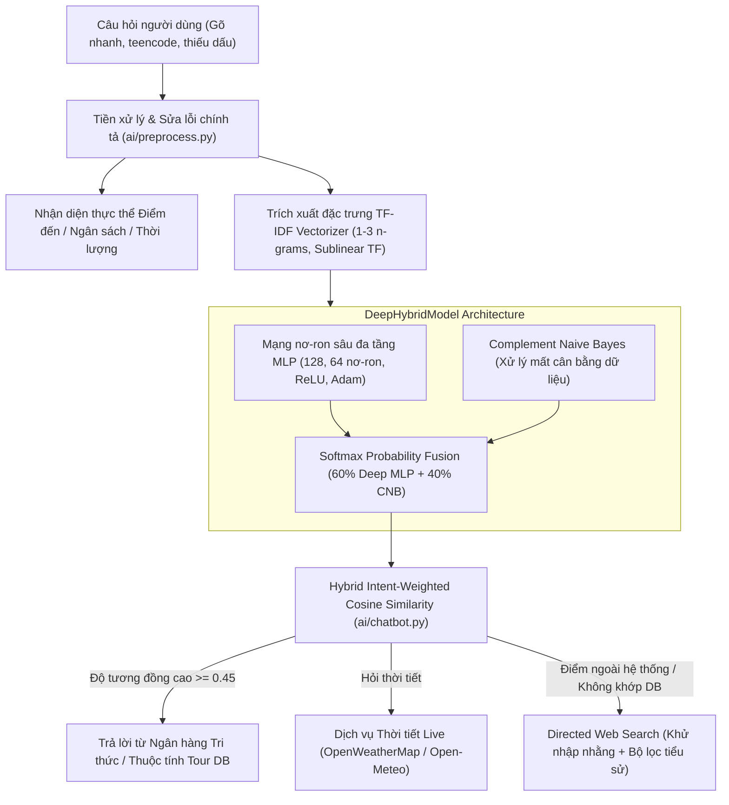

# Trí Tuệ Nhân Tạo (AI) - TourAI
## Đề tài: Xây Dựng Chatbot Xử Lý Ngôn Ngữ Tự Nhiên & Học Sâu Tư Vấn Tour Du Lịch

### Danh sách các thành viên thực hiện:
1. **Quang Duy Thai**
2. **Truong Hoai Son**
3. **Tran Long Vu**
4. **Le Nguyen Nam Anh**

---

### A. Giới thiệu tổng quan
**TourAI** là hệ thống tư vấn và quản lý tour du lịch thông minh, ứng dụng kết hợp giữa **Xử lý Ngôn ngữ Tự nhiên (NLP)**, **Kiến trúc Học sâu (Deep Learning Ensemble)** và **Dịch vụ Thời tiết Real-time & Web Search định hướng**. Hệ thống hỗ trợ người dùng trò chuyện tự nhiên, tra cứu lịch trình, gợi ý tour theo ngân sách/sở thích, tự động sửa lỗi chính tả và tìm kiếm thông tin du lịch cập nhật nhất.

---

### B. Các chức năng chính của hệ thống

#### 1. Chức năng người dùng (User Features)
- [x] **Đăng ký & Đăng nhập bảo mật**: Xác thực người dùng an toàn với mã hóa mật khẩu băm (Werkzeug Security), tự động phân quyền (User / Admin).
- [x] **Trợ lý Chatbot AI thông minh**:
  - **Học sâu & Phân loại ý định (Deep Intent Classification)**: Ứng dụng Mạng nơ-ron sâu đa tầng MLP kết hợp Complement Naive Bayes và phân tích vector TF-IDF (1-3 ngrams).
  - **Bộ nhớ ngữ cảnh đa lượt (Multi-turn Conversational Memory)**: Ghi nhớ tour đang tư vấn giúp trả lời các câu hỏi nối tiếp (*"tour này mấy ngày?", "giá bao nhiêu?", "khách sạn thế nào?"*) mà không cần người dùng nhắc lại địa danh.
  - **Tư vấn theo ngân sách & sở thích (Smart Recommendation Engine)**: Nhận diện thực thể số tiền (*"3tr5", "4 triệu", "500k"*...) và số ngày để đề xuất các tour phù hợp nhất.
  - **Khắc phục lỗi chính tả & Teencode (Fuzzy Spell Correction)**: Tự động sửa lỗi gõ dính, đảo chữ (*"phu qouc", "da lta", "ha logn", "nha trnag", "khasch sn"*), từ viết tắt (*"ks", "bn", "k", "vmb"*), hỗ trợ cả tiếng Việt có dấu và không dấu.
  - **Danh sách khách sạn & resort chi tiết**: Cung cấp gợi ý nơi lưu trú 3-5 sao cụ thể cho tất cả các điểm đến (Vinpearl, Victoria, Mường Thanh, Azerai...).
- [x] **Tra cứu thời tiết thời gian thực (Live Weather API)**:
  - Tích hợp **OpenWeatherMap API** và dự phòng tự động sang **Open-Meteo Global API** (miễn phí, không cần key, không lo lộ bí mật khi commit GitHub).
  - Cung cấp nhiệt độ thực tế, nhiệt độ cảm nhận, độ ẩm, sức gió, tình trạng mưa nắng và lời khuyên trang phục/phụ kiện du lịch.
- [x] **Tìm kiếm Internet thông minh (Directed Web Search)**:
  - Tự động tra cứu trực tuyến (DuckDuckGo & Wikipedia tiếng Việt) cho các điểm đến ngoài hệ thống hoặc kiến thức cẩm nang, ẩm thực.
  - Tích hợp **Khử nhập nhằng thực thể (Entity Disambiguation)** và **Bộ lọc loại trừ bài viết tiểu sử nhân vật** (tránh nhầm lẫn địa danh như *"TP Hồ Chí Minh"* với tiểu sử lịch sử).
- [x] **Khám phá & Tìm kiếm tour**: Tìm kiếm tour theo từ khóa, lọc theo danh mục, khoảng giá và sắp xếp linh hoạt.
- [x] **Chi tiết tour & Lịch trình**: Xem chi tiết từng ngày tham quan, hoạt động nổi bật, giá vé trọn gói.
- [x] **Quản lý lịch sử trò chuyện**: Lưu trữ phiên trò chuyện, tải lại lịch sử tin nhắn và tiếp tục trao đổi với AI.

#### 2. Chức năng quản trị viên (Admin Features)
- [x] **Trang tổng quan (Dashboard)**: Thống kê số lượng tour, người dùng, danh mục, câu hỏi mẫu, phiên trò chuyện và tin nhắn.
- [x] **Quản lý tour & Lịch trình**: Thêm, sửa, xóa tour du lịch và cấu hình chi tiết lịch trình từng ngày (`tour_schedule`).
- [x] **Quản lý danh mục**: Phân loại tour theo vùng miền (miền Bắc, Trung, Nam, Tây Nguyên, Biển đảo...).
- [x] **Quản lý tri thức AI (QA Data)**: Quản lý ngân hàng 273+ câu hỏi đáp mẫu, gán nhãn Intent và liên kết tour.
- [x] **Huấn luyện lại AI (Retrain Model)**: Tái huấn luyện Mạng nơ-ron sâu và cập nhật mô hình ngay lập tức chỉ với 1 click từ trang Admin mà không cần khởi động lại máy chủ.
- [x] **Quản lý người dùng & Phân quyền**: Xem danh sách thành viên, nâng/hạ quyền Admin hoặc xóa tài khoản.
- [x] **Nhật ký hội thoại (Chat Logs)**: Giám sát toàn bộ các câu hỏi thực tế của khách hàng để tối ưu hóa tri thức AI.

---

### C. Kiến trúc Trí Tuệ Nhân Tạo & Xử Lý Ngôn Ngữ Tự Nhiên



1. **Tiền xử lý đa tầng (Preprocessing & Typo Correction)**:
   - Chuẩn hóa từ viết tắt (`ks` -> `khách sạn`, `bn` -> `bao nhiêu`, `k` -> `không`...).
   - Khắc phục lỗi đảo chữ/gõ phím nhanh (`phu qouc` -> `phú quốc`, `da lta` -> `đà lạt`, `ha logn` -> `hạ long`).
   - Fuzzy Matching (Levenshtein Distance) với ngưỡng tương đồng $\ge 0.82$ trên từ điển chuyên ngành du lịch.
   - Hỗ trợ đồng thời cả câu hỏi có dấu và không dấu Unicode chuẩn.
2. **Kiến trúc Học sâu Mạng Nơ-ron Sâu (Deep MLP + ComplementNB)**:
   - Mạng nơ-ron sâu đa tầng (Multi-Layer Perceptron) với 2 tầng ẩn (128 và 64 nơ-ron), hàm kích hoạt phi tuyến tính ReLU, tối ưu hóa lan truyền ngược Adam và suy giảm trọng số $L_2$ Regularization ($\alpha=0.001$).
   - Kết hợp mô hình xác suất Complement Naive Bayes để bổ trợ cho các lớp dữ liệu thiểu số.
   - Cơ chế Softmax Probability Fusion kết hợp xác suất dự đoán: $P = 0.6 \times P_{MLP} + 0.4 \times P_{CNB}$.
3. **So khớp tương đồng lai ghép (Hybrid Intent-Weighted Cosine Similarity)**:
   - Đo khoảng cách Cosine trên không gian vector TF-IDF kết hợp tăng cường trọng số (+25%) cho các câu hỏi trùng intent dự đoán từ mô hình Deep Learning.
4. **Tìm kiếm Internet khử nhập nhằng (Entity Disambiguation Web Search)**:
   - Tự động bổ sung ngữ cảnh du lịch cho từ khóa (`địa điểm du lịch tham quan`, `khách sạn tốt nhất`, `món ngon ẩm thực`).
   - Tích hợp bộ lọc loại trừ bài viết tiểu sử nhân vật chính trị/lịch sử (tránh nhầm lẫn địa danh thành phố với nhân vật).

---

### D. Công nghệ sử dụng
* **Ngôn ngữ & Nền tảng**: Python 3.10+ / 3.12 / 3.14.
* **Web Framework**: Flask 3.x, Jinja2 Templates.
* **Cơ sở dữ liệu**: MySQL 8.x / MariaDB, MySQL Connector Python.
* **Khoa học dữ liệu & Machine Learning**: Scikit-Learn, NumPy, Underthesea.
* **Web Search**: DuckDuckGo API (DDGS), Wikipedia REST API.
* **Dịch vụ Thời tiết**: OpenWeatherMap API, Open-Meteo Global Forecast API.
* **Frontend**: Bootstrap 5, Bootstrap Icons, Modern Minimalist Custom CSS, JavaScript (ES6).

---

### E. Cấu trúc thư mục dự án

```text
├── ai/                         # Module Trí tuệ nhân tạo và Xử lý ngôn ngữ tự nhiên
│   ├── chatbot.py              # Chatbot AI: Điều phối hội thoại, Memory, Recommendation & Hybrid Matching
│   ├── preprocess.py           # Tiền xử lý, chuẩn hóa từ lóng, Fuzzy Typo Correction
│   ├── train_model.py          # Huấn luyện mô hình Học sâu DeepHybridModel (Deep MLP + CNB)
│   ├── weather_service.py      # Dịch vụ thời tiết đa nguồn (OpenWeatherMap + Open-Meteo)
│   └── web_search.py           # Tìm kiếm Internet có khử nhập nhằng và lọc chống lệch chủ đề
├── data/
│   └── sample_qa.json          # Ngân hàng 273 câu hỏi đáp mẫu chuẩn hóa
├── database/
│   ├── db.py                   # Kết nối cơ sở dữ liệu MySQL (hỗ trợ .env)
│   └── schema.sql              # Kịch bản khởi tạo database, bảng và dữ liệu 8 tour mẫu
├── models/                     # Các lớp thao tác dữ liệu (Data Access Objects)
│   ├── category.py             # Quản lý danh mục tour
│   ├── chat_history.py         # Quản lý tin nhắn hội thoại
│   ├── chat_session.py         # Quản lý phiên hội thoại
│   ├── qa_data.py              # Quản lý dữ liệu hỏi đáp AI
│   ├── tour.py                 # Quản lý thông tin tour và tìm kiếm
│   ├── tour_schedule.py        # Quản lý lịch trình từng ngày
│   └── user.py                 # Quản lý người dùng, mã hóa mật khẩu
├── routes/                     # Các bộ điều hướng (Controllers)
│   ├── admin_routes.py         # Các endpoint quản trị (/admin)
│   ├── auth_routes.py          # Đăng ký, đăng nhập, đăng xuất
│   ├── chat_routes.py          # Giao diện chat và API chatbot (/chatbot, /api/chat)
│   └── tour_routes.py          # Danh sách và chi tiết tour (/tours)
├── static/
│   ├── css/style.css           # Hệ thống giao diện Modern Minimalist Design
│   └── js/script.js            # Tiện ích JavaScript
├── templates/                  # Giao diện HTML Jinja2
│   ├── admin/                  # Các màn hình quản trị (Dashboard, Tours, QA, Users...)
│   ├── base.html               # Layout khung (Navbar, Footer)
│   ├── chatbot.html            # Giao diện Chatbot AI trực quan
│   ├── history.html            # Màn hình xem lại lịch sử phiên chat
│   ├── index.html              # Trang chủ hiện đại
│   ├── login.html              # Đăng nhập
│   ├── register.html           # Đăng ký
│   ├── tour_detail.html        # Chi tiết tour và lịch trình
│   ├── tours.html              # Danh sách tour du lịch
│   ├── 404.html                # Trang thông báo lỗi 404
│   └── 500.html                # Trang thông báo lỗi 500
├── .env                        # File cấu hình môi trường kết nối MySQL
├── .env.example                # File mẫu cấu hình môi trường
├── .gitignore                  # Cấu hình bỏ qua các file tạm, môi trường ảo và bí mật
├── app.py                      # Điểm khởi chạy ứng dụng Flask chính
├── check_and_init_db.py        # Script tự động kiểm tra và khởi tạo MySQL toàn diện
├── requirements.txt            # Danh mục thư viện Python phụ thuộc
├── test_connection.py          # Script kiểm tra nhanh kết nối MySQL
└── weatherapi.py               # File cấu hình API Key thời tiết (an toàn, có fallback khi rỗng)
```

---

### F. Hướng dẫn cài đặt và vận hành

#### 1. Yêu cầu môi trường
* Python 3.10 trở lên.
* MySQL Server hoặc Docker MySQL đang chạy ở cổng `3306`.

#### 2. Cài đặt các thư viện Python
```bash
pip install -r requirements.txt
```

#### 3. Tự động kiểm tra và khởi tạo cơ sở dữ liệu
Hệ thống cung cấp script thông minh tự động dò tìm MySQL (Docker, Native Service, XAMPP, Laragon...), tự động cập nhật `.env`, tạo database `chatbot_tour` và nạp toàn bộ 273 dữ liệu hỏi đáp AI:
```bash
python check_and_init_db.py
```

#### 4. Cấu hình API Thời tiết (Tùy chọn)
Hệ thống hỗ trợ 2 cách cấu hình thời tiết an toàn:
* **Cách 1**: Điền API key của [OpenWeatherMap](https://openweathermap.org/) vào file `weatherapi.py` ở thư mục gốc:
  ```python
  OPENWEATHER_API_KEY = "your_api_key_here"
  ```
* **Cách 2**: Để file `weatherapi.py` trống (`OPENWEATHER_API_KEY = ""`). Hệ thống sẽ tự động chuyển hướng dự phòng sang **Open-Meteo Global API** miễn phí hoàn toàn, không cần key, không sợ lộ bí mật khi đẩy code lên GitHub.

#### 5. Khởi chạy ứng dụng
```bash
python app.py
```
Truy cập ứng dụng tại trình duyệt: `http://localhost:5000`

---

### G. Tài khoản thử nghiệm mặc định

| Vai trò | Tên đăng nhập | Mật khẩu | Quyền hạn |
| :--- | :--- | :--- | :--- |
| **Quản trị viên (Admin)** | `admin` | `admin123` | Toàn quyền Dashboard, Quản lý Tour, QA Data, Retrain AI, Users |
| **Người dùng (User)** | `user` | `user123` | Đặt câu hỏi Chatbot, Lưu lịch sử, Xem tour du lịch |

---

### H. Một số câu hỏi mẫu thử nghiệm Chatbot AI

1. **Hỏi tour & giá cả**:
   - `Tour Phú Quốc 3 ngày 2 đêm giá bao nhiêu?`
   - `phu qouc 3n2d gia bn` *(thử nghiệm sửa lỗi chính tả & từ viết tắt)*
   - `Tôi có 4 triệu nên đi đâu?` *(thử nghiệm động cơ tư vấn theo ngân sách)*
   - `Tour nào rẻ nhất hiện nay?`
2. **Hỏi lịch trình & khách sạn**:
   - `1 vài khách sạn ở Cần Thơ` *(trả về danh sách khách sạn 4-5 sao cụ thể)*
   - `Lịch trình tour Sa Pa`
   - `Đi Sa Pa cần chuẩn bị gì?`
3. **Tra cứu thời tiết thời gian thực**:
   - `Thời tiết Đà Lạt hôm nay thế nào?`
   - `da lta co lanh k` *(thử nghiệm không dấu, lỗi chính tả gõ phím nhanh)*
   - `Hôm nay ở Hà Nội có mưa không?`
4. **Tìm kiếm địa điểm mở rộng qua Internet**:
   - `vài điểm tham quan ở hồ chí minh` *(khử nhập nhằng, lọc loại trừ tiểu sử nhân vật)*
   - `Điểm du lịch đẹp ở Huế`